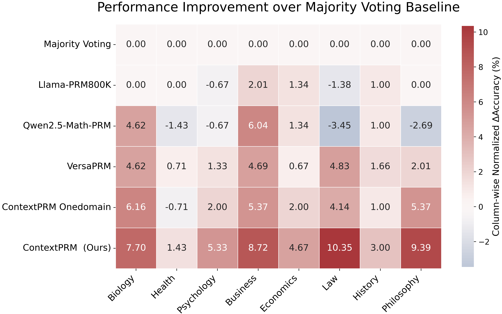
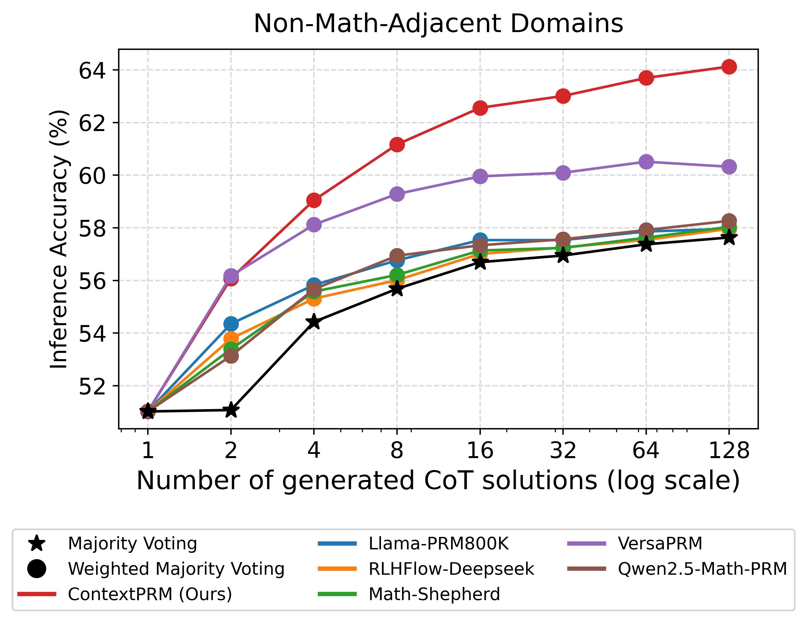

# ContextPRM: Leveraging Contextual Coherence for Multi-Domain Test-Time Scaling

<p align="center">
  
  
</p>

---

## 🚀 Introduction

**ContextPRM** is a novel framework designed to leverage contextual coherence to train Process Reward Models (PRMs) that generalize beyond traditional mathematical tasks. While existing PRMs excel in math-adjacent domains, they often struggle in humanities and other text-rich subjects. By focusing on contextual coherence, ContextPRM enables effective **multi-domain test-time scaling**, significantly improving reasoning accuracy across diverse fields such as Law, Philosophy, Business, and Biology.

---

## 📢 News

* 🚧 **[Work in Progress]** We are currently in the process of releasing the initial training code and datasets. The repository is actively being updated.

---

## 📊 Results

As shown in the figures above, ContextPRM significantly improves upon baseline methods:

* **Broad Generalization:** ContextPRM demonstrates substantial normalized accuracy improvements over the Majority Voting baseline across various domains, including **Law (+10.35%)**, **Philosophy (+9.39%)**, and **Business (+8.72%)**.

* **Test-Time Scaling:** On Non-Math-Adjacent Domains, ContextPRM consistently scales with additional compute, reaching over **64% inference accuracy** at 128 generated Chain-of-Thought (CoT) solutions, outperforming other state-of-the-art reward modeling approaches.

---

## 📖 How to Use

> **Note:** 🚧 Code and documentation are still being uploaded and refined. The following instructions cover the preliminary training setup. Full usage and inference instructions will be added soon. 🚧

### Environment Setup

Install the required dependencies:

```bash
pip install -r requirements.txt
```

### Training Data

Please download the training data from [this Google Drive link](https://drive.google.com/drive/folders/18HQlnkEfei7uh30eKUYF4EEj5UP0-7T6?usp=drive_link).

The folder contains two JSON files: one for the `PRM800K` data and the other for `MMLU-Pro-Train`. These files are already formatted to be compatible with our data loading functions.

* Please place both downloaded files into the `data/` directory.

### Running Training

First, configure your distributed training environment:

```bash
accelerate config
```

*Configuration guidelines:*

* Specify the number of GPUs you are using for multi-GPU training.
* Set the precision to `bf16`.
* Set gradient clipping to `1`.
* **Important:** Ensure the total batch size equals **128**. You need to verify this based on your hardware: `Number of GPUs * gradient_accumulation_steps * per_device_batch_size = 128` (You can configure this in your config file, e.g., `train_configs/qwen_prm800k`).

We highly recommend using **DeepSpeed** for data-parallel model training, which can be easily set up during the `accelerate config` process.

Once configured, start the training script:

```bash
./run_training.sh
```

---

## ❤️ Acknowledgements

We build our work upon the fantastic contributions from the open-source community. We would like to express our special gratitude to the authors and maintainers of **VersaPRM**. Our implementation has greatly benefited from their codebase:

* [UW-Madison-Lee-Lab/VersaPRM](https://github.com/UW-Madison-Lee-Lab/VersaPRM)
